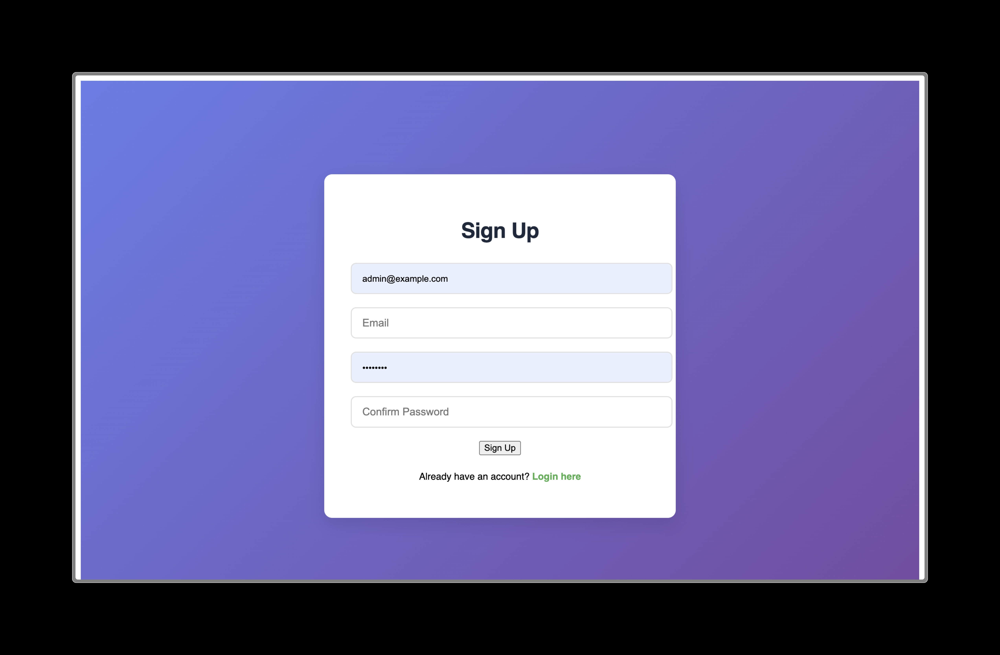
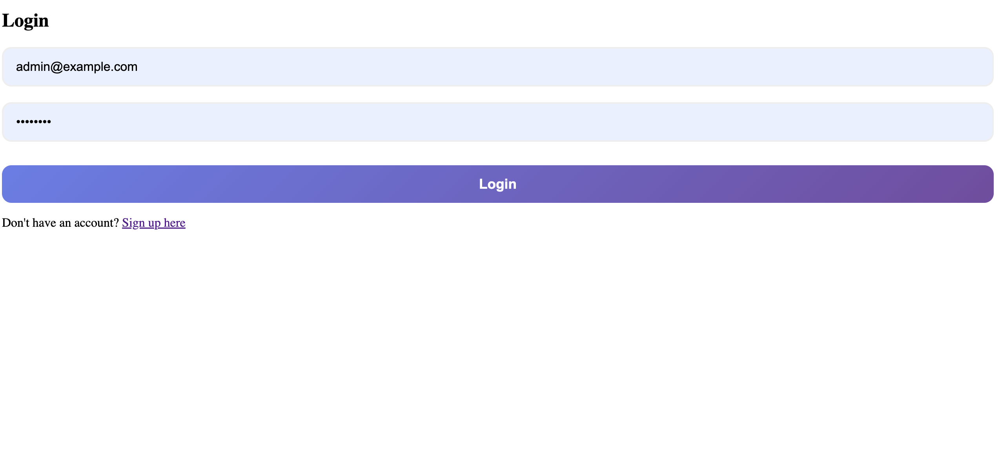
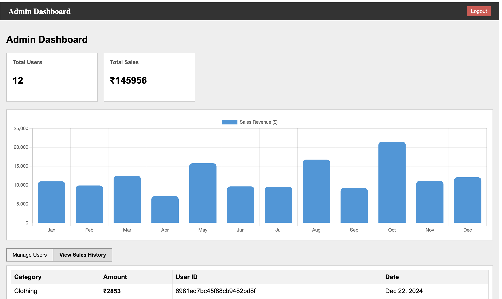
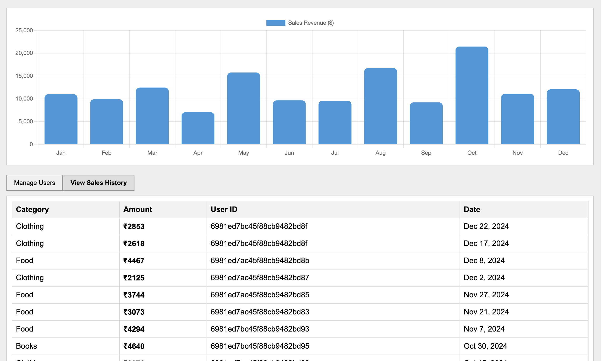
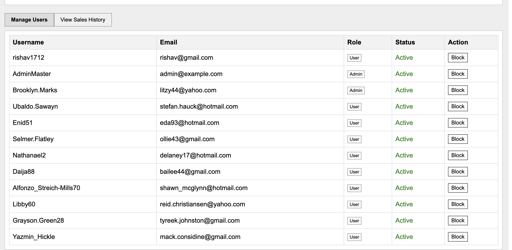

# Full-Stack Admin Dashboard (Angular & Node.js)

This is a professional Admin Dashboard assignment built using the MEAN stack. It features user authentication, role-based access control, and real-time data visualization.

## 🚀 Features
- **Authentication**: Secure Login and Signup pages.
- **Role Management**: Admin can change user roles (Admin/User) directly from the dashboard.
- **User Control**: Ability to block/unblock users (Active/Inactive status).
- **Data Visualization**: Dynamic Bar Chart showing monthly sales using Chart.js.
- **Responsive Design**: Fully responsive UI for mobile and desktop.

## 🛠️ Tech Stack & Versions
- **Frontend**: Angular 17+ (SCSS, TypeScript)
- **Backend**: Node.js (Express.js)
- **Database**: MongoDB
- **Chart Library**: Chart.js 4.x
- **Icons/Fonts**: Google Fonts (Segoe UI / Roboto)

## 📸 Screenshots

### 1. Sign Up Page

### 2. Login Page

### 3. Admin Dashboard (Stats & Chart)

### 4. User Management (Manage Users Tab)

### 5. Sales History (View Sales Tab)

## ⚙️ Local Setup Instructions

### Prerequisites
- Node.js (v18 or v20 recommended)
- MongoDB (Local or Atlas)
- Angular CLI (`npm install -g @angular/cli`)

### Backend Setup
1. Navigate to the server folder: `cd server`
2. Setup environment variables
3. Install dependencies: `npm install`
4. Create a `.env` file and add your `MONGO_URI` and `JWT_SECRET`.
5. Feed some data in database using node `seedFakeData.js`.
5. Start the server: `npm run dev` (or `node index.js`)

### Frontend Setup
1. Navigate to the client folder: `cd client`
2. Install dependencies: `npm install`
3. Run the application: `ng serve`
4. Open your browser at: `http://localhost:4200`

---
Developed by [Rishav] as part of the WINNR Assignment.